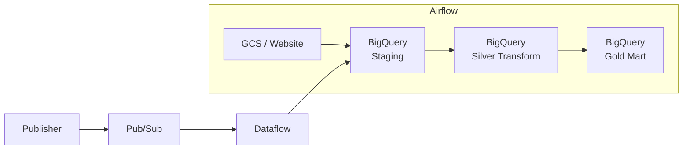

# Capstone Project 3 — Green Taxi Batch & Streaming Pipeline

## 1. Deskripsi Project

Project ini merupakan Capstone Project Module 3 dari Bootcamp Data Engineer Purwadhika.

Project ini bertujuan untuk membangun pipeline data **batch dan streaming** untuk NYC Green Taxi menggunakan:

- Google Cloud Storage
- Google Pub/Sub
- Google Dataflow
- Google BigQuery
- Apache Airflow
- Docker Compose
- Python dan SQL

Data batch April–Mei 2026 dimuat dari GCS ke BigQuery. Data streaming dikirim melalui Publisher ke Pub/Sub, diproses oleh Dataflow, lalu disimpan ke BigQuery. Airflow digunakan untuk membuat dataset, memuat data batch, melakukan transformasi Silver, membangun Gold Mart, dan menjalankan quality check.

---

## 2. Flow Arsitektur Pipeline




## 3. Cara Menjalankan Program

### A. Menjalankan Airflow

Aktifkan Docker Desktop, lalu jalankan:

```powershell
docker compose up -d
```

Buka Airflow:

```text
http://localhost:8090
```

Login default:

```text
Username: airflow
Password: airflow
```

### B. Membuat Dataset dan Tabel Streaming

Trigger DAG:

```text
jcdeah_009_jonathan_streaming
```

DAG ini membuat:

```text
cp3_jonathan_staging
├── stg_green_taxi_stream
└── rejected_stream_events
```

### C. Menjalankan Data Streaming

Aktifkan virtual environment:

Jalankan Dataflow:

```powershell
python -m streaming.pipeline
```

Periksa status:

```powershell
gcloud dataflow jobs list --region=asia-southeast2 --status=active
```

Setelah status Dataflow menjadi `Running`, jalankan publisher:

```powershell
python -m streaming.publisher --count 20 --rate 2
```

Untuk menguji data tidak valid:

```powershell
python -m streaming.publisher --count 20 --rate 2 --invalid-every 5
```

Periksa hasil streaming:

```sql
SELECT COUNT(*) AS total_stream
FROM `jcdeah-009.cp3_jonathan_staging.stg_green_taxi_stream`;
```

```sql
SELECT COUNT(*) AS total_rejected
FROM `jcdeah-009.cp3_jonathan_staging.rejected_stream_events`;
```

Setelah selesai, drain Dataflow

### D. Menjalankan Pipeline End-to-End

Trigger DAG:

```text
jcdeah_009_jonathan_green_taxi_end_to_end
```

DAG akan:

1. load data April dan Mei.
2. load taxi zone.
3. Memastikan data streaming tersedia.
4. Membuat Silver Layer.
5. Menggabungkan batch dan streaming.
6. Membuat Gold Mart.
7. Menjalankan quality check.

---

## 4. Cara Menjalankan Query Analisis

Semua query analisis disimpan pada:

```text
sql/query_analytics.sql
```

Cara menjalankan:

1. Buka Google BigQuery
2. Buka file `sql/query_analytics.sql`
3. Salin query yang ingin dijalankan
4. Tempel ke BigQuery Query Editor
5. Klik **Run**.

---

## 5. Struktur Folder

```text
capstone-project-3/
├── .venv/
│
├── config/
│
├── dags/
│   ├── __pycache__/
│   ├── jcdeah_009_jonathan_green_taxi_end_to_end.py
│   └── jcdeah_009_jonathan_streaming.py
│
├── jcdeah_009_green_taxi_streaming.egg-info/
│   ├── dependency_links.txt
│   ├── PKG-INFO
│   ├── requires.txt
│   ├── SOURCES.txt
│   └── top_level.txt
│
├── logs/
│
├── screenshot/
│
├── sql/
│   ├── batch/
│   │   ├── check_batch_clean.sql
│   │   └── create_batch_clean_tables.sql
│   │
│   ├── gold_mart/
│   │   ├── create_schema_gold.sql
│   │   ├── vw_daily_trip_summary.sql
│   │   ├── vw_payment_summary.sql
│   │   └── vw_zone_performance.sql
│   │
│   ├── silver_transform/
│   │   ├── check_green_taxi_clean.sql
│   │   ├── create_green_taxi_clean.sql
│   │   ├── create_schema_silver.sql
│   │   └── create_taxi_zone.sql
│   │
│   ├── staging/
│   │   └── create_staging.sql
│   │
│   ├── streaming/
│   │   ├── check_stream_clean.sql
│   │   ├── create_stream_clean_table.sql
│   │   └── create_stream_tables.sql
│   │
│   └── query_analytics.sql
│
├── streaming/
│   ├── __pycache__/
│   ├── __init__.py
│   ├── pipeline.py
│   ├── publisher.py
│   └── schemas.py
│
├── .dockerignore
├── .env
├── .env.example
├── .gitignore
├── docker-compose.celery.backup.yaml
├── docker-compose.yaml
├── dockerfile
├── README.md
├── requirements-airflow.txt
├── requirements-streaming.txt
├── requirements.txt
├── setup.py
└── README.md
```

---

## 6. Penjelasan Desain Tabel

### A. Staging Layer

Dataset:

```text
cp3_jonathan_staging
```

| Tabel | Fungsi |
|---|---|
| `stg_green_taxi_2026_04` | Menyimpan raw batch April 2026 |
| `stg_green_taxi_2026_05` | Menyimpan raw batch Mei 2026 |
| `stg_taxi_zone` | Menyimpan referensi taxi zone |
| `stg_green_taxi_stream` | Menyimpan event streaming valid |
| `rejected_stream_events` | Menyimpan event streaming tidak valid |

Staging menyimpan data mentah sebelum dibersihkan.

### B. Silver Layer

Dataset:

```text
cp3_jonathan_silver_transform
```

| Tabel | Fungsi |
|---|---|
| `green_taxi_batch_clean` | Data batch yang sudah dibersihkan |
| `green_taxi_stream_clean` | Data streaming yang sudah dibersihkan |
| `taxi_zone` | Referensi zona yang sudah distandarisasi |
| `green_taxi_clean` | Gabungan batch, streaming, dan taxi zone |

Transformasi utama meliputi:

- Filter nilai tidak valid.
- Validasi durasi perjalanan.
- Standarisasi kategori vendor, rate code, dan payment type.
- Penambahan atribut waktu.
- Join pickup dan dropoff zone.
- Penambahan kolom `source_type` untuk membedakan batch dan stream.

### C. Gold Layer

Dataset:

```text
cp3_jonathan_gold_mart
```

| View | Fungsi |
|---|---|
| `vw_daily_trip_summary` | Ringkasan perjalanan harian |
| `vw_payment_summary` | Ringkasan berdasarkan metode pembayaran |
| `vw_zone_performance` | Ringkasan performa pickup dan dropoff zone |

Gold Layer digunakan untuk analisis dan reporting.

---

## Ringkasan Flow Demo

```text
1. Trigger DAG jcdeah_009_jonathan_streaming
2. Jalankan Dataflow
3. Jalankan Publisher
4. Periksa data valid dan rejected
5. Drain Dataflow
6. Trigger DAG jcdeah_009_jonathan_green_taxi_end_to_end
7. Periksa Silver Layer
8. Periksa Gold Mart
9. Jalankan query analytics
```
